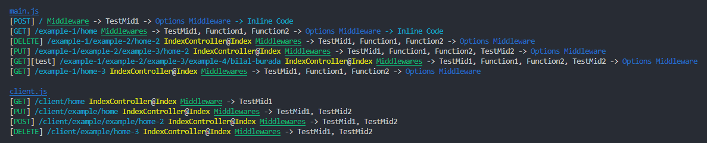

# **Express Dynamic Router Creator**
> With this module you will be able to write dynamic created routing with express.

## **Features**

- Change the folders required for the dynamic router.
    - Routers Folder
    - Middlewares Folder
    - Controllers Folder
    
- Define the main route file in the defined route folder.

> ***Note***: **In order to use this library, you need to include the express and fs libraries.**

## **Configuration**

    ...
    
    //Import
    const DynamicRoute=require("./module/index");
    
    ...
    
    DynamicRoute.Config({
        app:express(), //Express
        folders:{
            routers:'routers', //Routers folder
            middlewares:'middlewares', //Middlewares folder
            controllers:'controllers' //Controllers folder
        },
        mainFile:'main.js', //It is your main file in the Routers folder.
        log:true //If the log is open it will tell you about the URLs.
    });
    
> **Note:** The output of the open log feature.
> 
> 

> **Note:** The file that creates dynamic routing is the **index.js** file. In the example, it is in the **module** folder.

### Folder Structure (Example)
        1. controllers
        2. middlewares
        3. module
        4. routers
        5. server.js
        
### Code Example
   main.js (example/routers/main.js)
   
    ...
    
    const example=require('./example');
    
    ...
    
    module.exports={
        rootUrl:'api',
        version:{
            text:'v',
            number:1
        },
        middleware:'SetHeader', // or ['TestMid1','TestMid2',...] -> The middleware(s) will affect the whole project.
        routes:[
            {
                method:'GET',
                url:'home',
                controller:'IndexController',
                action:'Index',
                middleware:['TestMid1','TestMid2'] // or 'SetHeader' -> The middleware(s) will affect the route.
            },
            {
                groupUrl:'example',
                groupRoutes:example
            }
        ]
    };
    
   example.js (example/routers/example.js)
   
    module.exports=[
        {
            method:'GET',
            url:'home',
            controller:'IndexController',
            action:'Index',
            middleware:'TestMid1' // or ['TestMid1','TestMid2',...] -> The middleware(s) will affect the route.
        }
    ];
    
> RootUrl and version are optional. The text and number fields in the version are also optional.

### Routing Examples

    1. http://localhost:[YOUR_APP_PORT]/[ROOT_URL]/[VERSION_TEXT][VERSION_NUMBER]/[ROUTES_URL]
    2. http://localhost:[YOUR_APP_PORT]/[ROOT_URL]/[VERSION_NUMBER]/[ROUTES_URL]
    3. http://localhost:[YOUR_APP_PORT]/[ROOT_URL]/[VERSION_TEXT]/[ROUTES_URL]
    4. http://localhost:[YOUR_APP_PORT]/[VERSION_TEXT][VERSION_NUMBER]/[ROUTES_URL]
    5. http://localhost:[YOUR_APP_PORT]/[VERSION_NUMBER]/[ROUTES_URL]
    6. http://localhost:[YOUR_APP_PORT]/[VERSION_TEXT]/[ROUTES_URL]
    7. http://localhost:[YOUR_APP_PORT]/[ROOT_URL]/[ROUTES_URL]
    8. http://localhost:[YOUR_APP_PORT]/[ROUTES_URL]