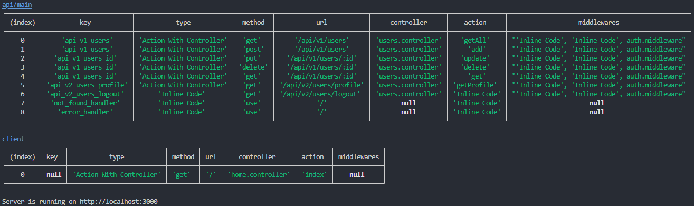

# **Express Dynamic Router Creator**
> With this module you will be able to write dynamic created routing with express.

## **Features**

- Change the folders required for the dynamic router.
    - Routers Folder
    - Middlewares Folder
    - Controllers Folder
    
- Define the main route file in the defined route folder.

> ***Note***: **In order to use this library, you need to include the express and fs libraries.**

## **Install and Configuration**

   `npm install --save express-dynamic-router-creator`

    ...
    
    //Import
    const express=require('express');
    const app=express();
    const path=require('path');
    const DynamicRoute=require('express-dynamic-router-creator');
    
    ...
    
    DynamicRoute.Config({
        app:app,
        folders:{
            routers:path.join(__dirname,'routers'), //Routers folder
            middlewares:path.join(__dirname,'middlewares'), //Middlewares folder - Optional
            controllers:path.join(__dirname,'controllers') //Controllers folder
        },
        mainFile:['main.js','root.js','test.js'], //OR 'main.js' -> It is your main file in the Routers folder.
        log:true //If the log is open it will tell you about the URLs.
    });
    
> **Info:** The files or files you define in mainFile work independently of each other. For example, if you have a router for the front of a route file, then the other file contains the necessary routing for the background. When defining a file, you need to enter the file name into '. If you want to define more than one file, you must define your files in an array.

> **Note:** The output of the open log feature.
> 
> 

> **Note:** The file that creates dynamic routing is the **index.js** file. In the example, it is in the **module** folder.

### Folder Structure (Example)
        1. controllers
        2. middlewares
        3. routers
        4. server.js
        
### Code Example
   main.js ([example/routers/main.js](example/routers/main.js))
   
    ...

    const cors = require('cors');
    const example = require('./example');
    
    ...

    const WhiteList = ['http://localhost:3030'];
    var corsOptions = {
        origin: function (origin, callback) {
            if (WhiteList.indexOf(origin) !== -1 || !origin) {
                callback(null, true)
            } else {
                callback({status:403,data:'You do not have permission!'});
            }
        },
        optionsSuccessStatus: 200,
        methods:'OPTIONS',
        credentials:true
    }
    
    ...

    module.exports={
        rootUrl:'api', //Optional
        version:{ //Optional
            text:'v', //Optional
            number:1 //Optional
        },
        optionsMiddleware:cors(corsOptions), - Optional
        middleware:'SetHeader', // or ['TestMid1','TestMid2',...] -> The middleware(s) will affect the whole project. - Optional
        routes:[
            {
                method:'GET',
                url:'home',
                controller:'IndexController',
                action:'Index',
                middleware:['TestMid1','TestMid2'], // or 'SetHeader' -> The middleware(s) will affect the route. - Optional
            },
            {
                groupUrl:'example',
                middleware:['TestMid1','TestMid2'], // or 'SetHeader' -> The middleware(s) will affect the route. - Optional
                groupRoutes:example
            }
        ]
    };
    
   example.js ([example/routers/example.js](example/routers/example.js))
   
    module.exports=[
        {
            method:'GET',
            url:'home',
            controller:'IndexController',
            action:'Index',
            middleware:'TestMid1' // or ['TestMid1','TestMid2',...] -> The middleware(s) will affect the route. - Optional
        }
    ];
    
> RootUrl and version are optional. The text and number fields in the version are also optional.

### Routing Examples

    1. http://localhost:[YOUR_APP_PORT]/[ROOT_URL]/[VERSION_TEXT][VERSION_NUMBER]/[ROUTES_URL]
    2. http://localhost:[YOUR_APP_PORT]/[ROOT_URL]/[VERSION_NUMBER]/[ROUTES_URL]
    3. http://localhost:[YOUR_APP_PORT]/[ROOT_URL]/[VERSION_TEXT]/[ROUTES_URL]
    4. http://localhost:[YOUR_APP_PORT]/[VERSION_TEXT][VERSION_NUMBER]/[ROUTES_URL]
    5. http://localhost:[YOUR_APP_PORT]/[VERSION_NUMBER]/[ROUTES_URL]
    6. http://localhost:[YOUR_APP_PORT]/[VERSION_TEXT]/[ROUTES_URL]
    7. http://localhost:[YOUR_APP_PORT]/[ROOT_URL]/[ROUTES_URL]
    8. http://localhost:[YOUR_APP_PORT]/[ROUTES_URL]